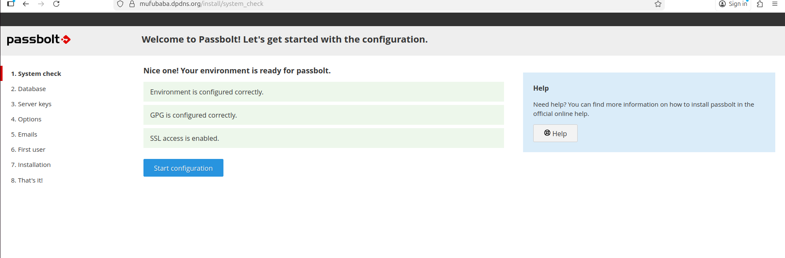
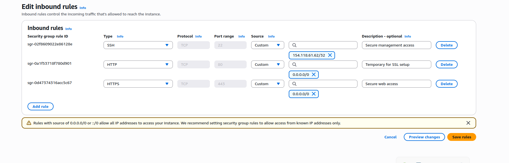
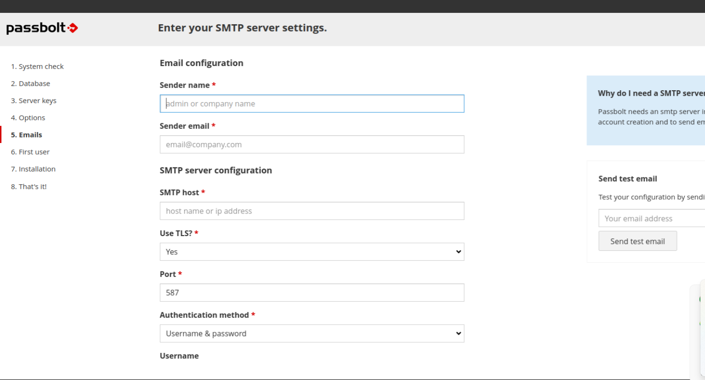

> **Production-grade, self-hosted password management solution deployed on AWS with end-to-end encryption, zero-trust principles, and secure recovery workflows.**

# Passbolt Password Manager on AWS  
**Self-Hosted, End-to-End Encrypted Credential Management**

As an **ISC² Certified in Cybersecurity (CC)** professional, I designed, deployed, and hardened a **self-hosted Passbolt password manager** on AWS to eliminate insecure credential sharing and enforce **data sovereignty, encryption everywhere, and zero-trust access controls**—with no reliance on third-party trust.

This project reflects how secure credential infrastructure should be deployed **in real environments**, not demos.

---

## Project Objective

The goal was to replace insecure password-sharing methods (spreadsheets, chat tools, plaintext notes) with a **secure, auditable, and encrypted password management platform** that:

- Never exposes secrets in plaintext  
- Enforces encryption before first use  
- Uses HTTPS from the very first connection  
- Supports secure recovery without weakening encryption  

> **Critical Security Decision:**  
> I intentionally refused to access the platform over HTTP at any stage, preventing master password exposure during initial setup—a common real-world misconfiguration.

---

## Security Architecture Overview

This deployment enforces the following controls:

- **End-to-end encryption** using client-side GPG keys  
- **HTTPS-only access** with Let’s Encrypt SSL/TLS  
- **Zero-trust credential handling** (server never sees plaintext secrets)  
- **Secure account recovery** via SMTP with TLS and app-based passwords  
- **Least-privilege AWS networking** (SSH restricted to admin IP only)  

---

## Features Implemented Securely

- End-to-end encrypted secrets (GPG-based, client-side)  
- Automated password generation with strong entropy  
- SMTP integration for MFA, recovery, and security notifications  
- Offline recovery kit generation and secure storage  
- SSL/TLS enforced **before first login**  
- AWS Security Groups configured using least-privilege principles  

---

## Evidence & Screenshots

### Passbolt Dashboard


*Fully deployed over HTTPS with client-side encryption enabled.*

### AWS Security Group Configuration


*SSH access restricted to administrator IP only; HTTPS exposed securely.*

### SSL/TLS Certificate Details


*Valid Let’s Encrypt certificate — no self-signed or insecure TLS.*

### SMTP Configuration


*SMTP secured with TLS and app-based authentication for recovery and MFA.*

---

## Secure Deployment Methodology

### 1. AWS Infrastructure Setup
- Launched **Passbolt Community Edition** on EC2  
- Created a dedicated SSH key pair (`passbolt-project-key.pem`)  
- Configured Security Groups:
  - SSH: restricted to my IP only  
  - HTTPS: public access  

### 2. HTTPS Enforcement Before First Access
- Updated local hosts file to avoid DNS propagation delays  
- Installed SSL using:
  ```bash
  passbolt-configure --ssl=auto
